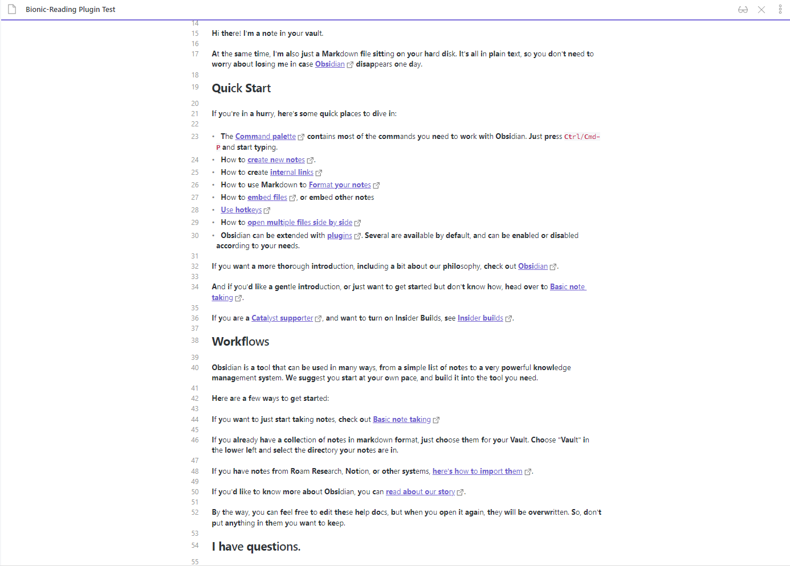

# Obsidian Bionic Reading

A plugin to enable bionic reading mode in Live preview mode of Obsidian.

## Settings

1. Allow bionic reading mode: Make the bionic reading works in Obsidian.

## How to Install

### From Plugin Market in Obsidian

💜: Directly install from Obsidian Market.

### From BRAT

🚗: Add `Quorafind/Obsidian-Bionic-Reading` to BRAT.

### Download Manually

🚚: Download the latest release. Extract and put the three files (main.js, manifest.json, styles.css) to folder `{{obsidian_vault}}/.obsidian/plugins/Obsidian-Bionic-Reading`.

## Say Thank You

If you are enjoy using Obsidian-Bionic-Reading then please support my work and enthusiasm by buying me a coffee on [https://www.buymeacoffee.com/boninall](https://www.buymeacoffee.com/boninall).

